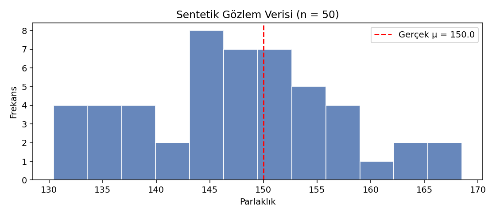
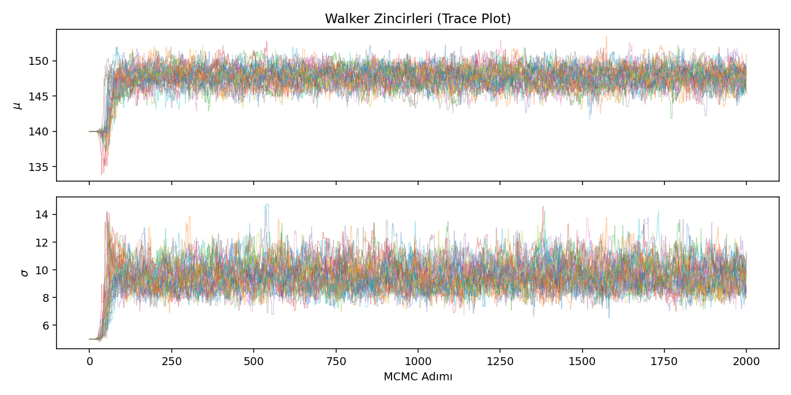
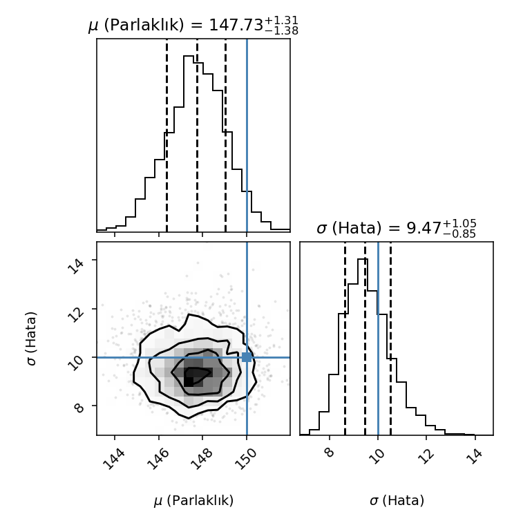
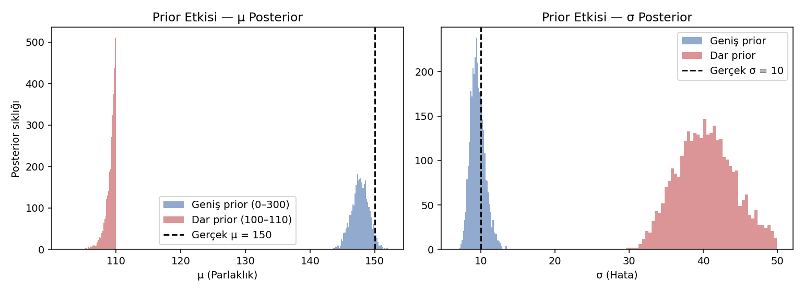
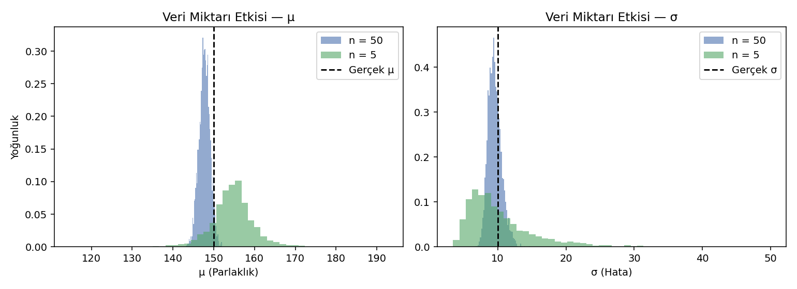

# HMM ile İzole Kelime Tanıma

YZM212 Makine Öğrenmesi dersi 1. Laboratuvar Ödevi

---

## Problem Tanımı

Bu projede Gizli Markov Modeli (HMM) kullanılarak izole kelime tanıma sistemi tasarlanmıştır.
"EV" ve "OKUL" kelimeleri için ayrı HMM modelleri oluşturulmuş, gelen ses gözlem dizisi
hangi modelde daha yüksek Log-Likelihood veriyorsa o kelime olarak sınıflandırılmıştır.

---

## Veri

Her kelime için gözlem dizileri iki sembolden oluşur: `High` (0) ve `Low` (1).
Bu semboller sesin frekans karakteristiğini temsil eder.

**Test gözlem dizileri:**
- `[High, Low]` → EV beklenir
- `[Low, Low, Low, Low]` → OKUL beklenir
- `[High, High]` → EV beklenir
- `[Low, Low]` → OKUL beklenir

---

## Yöntem

Her kelime için `hmmlearn` kütüphanesiyle `CategoricalHMM` modeli tanımlanmıştır.
Modeller başlangıç, geçiş ve emisyon olasılıklarıyla elle yapılandırılmıştır.
Sınıflandırma için `model.score()` fonksiyonu ile Log-Likelihood hesaplanmış,
yüksek skoru veren model kazanan ilan edilmiştir.

---

## Sonuçlar

| Gözlem Dizisi | EV Skoru | OKUL Skoru | Tahmin |
|---------------|----------|------------|--------|
| [High, Low] | -0.9729 | -1.2730 | **EV** ✓ |
| [Low, Low, Low, Low] | -2.4702 | -1.4585 | **OKUL** ✓ |
| [High, High] | -1.1332 | -2.1203 | **EV** ✓ |
| [Low, Low] | -1.8202 | -0.8675 | **OKUL** ✓ |

4/4 test doğru sınıflandırıldı.

---

## Yorum / Tartışma

Model, High ağırlıklı dizileri EV, Low ağırlıklı dizileri OKUL olarak başarıyla
sınıflandırmaktadır. Bu sonuç, elle tasarlanan HMM parametrelerinin kelimeler
arasındaki frekans farklılığını yeterince yansıttığını göstermektedir.

Gerçek bir sistemde gürültü emisyon olasılıklarını bozacağından model performansı
düşebilir. Binlerce kelime içeren büyük ölçekli sistemlerde ise Viterbi + HMM yerine
Transformer tabanlı modeller (Whisper, wav2vec) tercih edilmektedir.

---
---

# Ödev 4 — Uzak Bir Galaksinin Parlaklık Analizi (Bayesyen Çıkarım)

YZM212 Makine Öğrenmesi dersi 4. Laboratuvar Ödevi

## Problem Tanımı

Gürültülü gözlem verilerinden bir gök cisminin gerçek parlaklığını (μ) ve
gözlem belirsizliğini (σ) Bayesyen yöntemle tahmin ediyoruz. Astronomide
deney yapılamadığı için Bayesyen çıkarım — prior bilgi, tam posterior
dağılım ve küçük veri setleriyle iyi çalışma avantajı sayesinde — altın
standart kabul edilir.

## Veri

Sentetik olarak üretilmiş 50 gözlemlik parlaklık verisi:

- `true_mu = 150.0` (gerçek parlaklık)
- `true_sigma = 10.0` (gözlem gürültüsü)
- `n_obs = 50`
- `np.random.seed(42)` (deterministik üretim)

Veri `data/gozlem_verisi.csv` içinde kaydedilmiştir.

## Yöntem

`emcee` kütüphanesi ile **Markov Chain Monte Carlo (MCMC)** örneklemesi:

- 32 walker, 2000 adım; ilk 500 adım burn-in, `thin=15`.
- **Log-Likelihood:** Gauss varsayımı.
- **Log-Prior:** `0 < μ < 300`, `0 < σ < 50` (geniş, informatif olmayan).
- **Log-Posterior:** Prior + Likelihood (Bayes teoremi).

Kod: [src/bayesian_brightness.ipynb](src/bayesian_brightness.ipynb)

## Sonuçlar

### 5.1 · Parametre Karşılaştırma Tablosu

| Değişken | Gerçek Değer | Tahmin (Median) | Alt Sınır (%16) | Üst Sınır (%84) | Mutlak Hata |
|----------|:------------:|:---------------:|:---------------:|:---------------:|:-----------:|
| μ (Parlaklık)   | 150.0 | 147.732 | 146.356 | 149.044 | 2.268 |
| σ (Hata Payı)   |  10.0 |   9.467 |   8.617 |  10.519 | 0.533 |

### Grafikler

- 
- 
- 
- 
- 

Tüm grafikler ve yorumlar tek PDF olarak: [report/Odev4_Rapor.pdf](report/Odev4_Rapor.pdf)

## Yorum / Tartışma

### 6.1. Merkezi Eğilim ve Doğruluk (Accuracy)

Posterior median μ = **147.73**, gerçek değer 150.0 → mutlak hata **2.27**
(~%1.5). Gürültü oranı σ/μ ≈ %6.7 olmasına rağmen MCMC, ortalamaya
oldukça yakın bir tahminde bulundu. Bu hata, örneklem ortalamasının
standart hatası σ/√n ≈ 1.41 ile uyumludur; yani model yapısal bir
yanlılık içermiyor, sadece sonlu veri nedeniyle doğal bir sapma var.

### 6.2. Tahmin Hassasiyeti (Precision) Karşılaştırması

μ için posterior %68 aralığı ~2.7 birim genişliğindeyken σ için ~1.9
birim — *mutlak* olarak σ daha dar görünebilir ama *göreli* olarak
(σ/σ) daha belirsizdir. Büyük-örneklem teorisinde:

$$\text{SE}(\hat\mu)=\frac{\sigma}{\sqrt{n}}, \qquad \text{SE}(\hat\sigma)=\frac{\sigma}{\sqrt{2n}}$$

σ'yı tahmin etmek **ikinci moment** bilgisi (sapmaların karesi)
gerektirir ve bu, kuyruk verisine çok daha duyarlıdır. n = 50 ile μ
için yeterli bilgi birikir; σ için posterior daha geniş ve asimetrik
kalır.

### 6.3. Olasılıksal Korelasyon Analizi

Gauss likelihood'unda μ ve σ matematiksel olarak **bağımsızdır**
(ortalama ile varyans bilgisi örtüşmez). Corner plot'taki 2B
konturların eksenlere paralel dik elips şeklinde olması bunu doğrular
— μ ve σ arasındaki posterior korelasyon yaklaşık sıfırdır.

### Deney A — Dar Prior Etkisi (Soru 1)

μ için prior [100, 110] aralığına daraltıldığında posterior, veriye
rağmen prior sınırına **sıkıştı**. Gerçek değer 150 olduğu için bu
prior yanlıştır; sonuç olarak hem μ hem σ ciddi şekilde saptı. Prior
bilgi *güçlü ama yanlışsa* veriyi bastırır — priorlar mutlaka fiziksel
gerekçelendirmeyle seçilmelidir.

### Deney B — Veri Miktarı Etkisi (Soru 2)

n=50'den n=5'e düşüldüğünde posterior genişliği teoriyle uyumlu
şekilde ~√10 ≈ 3.16 kat arttı. Özellikle σ için küçük örneklem,
dağılımı belirgin biçimde asimetrikleştirdi. Bu, Bayesyen çıkarımın
küçük veri setlerinde bile bir "en iyi tahmin + tam belirsizlik"
sunmasının pratik gücünü gösteriyor.

## Çalıştırma

```bash
pip install -r requirements.txt
jupyter nbconvert --to notebook --execute src/bayesian_brightness.ipynb
```
veya interaktif:
```bash
jupyter notebook src/bayesian_brightness.ipynb
```
